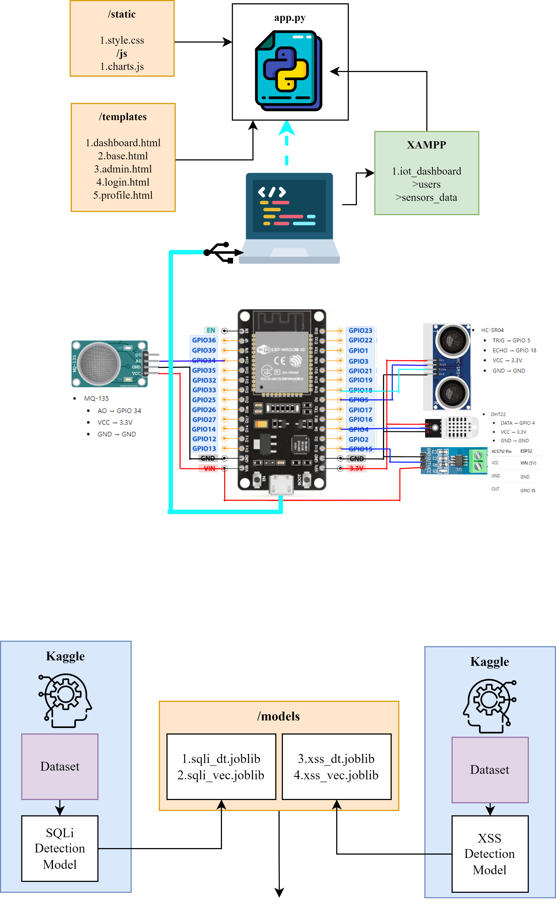

# 🔐 SEC-IoT  
**Secure Industrial IoT Monitoring & Analytics Platform**

SEC-IoT is an end-to-end **Industrial IoT monitoring system** that integrates **ESP32-based sensor nodes**, a **Flask web dashboard**, **XAMPP (MySQL) backend**, and is designed to be **ML-ready** for future prediction, security, and explainable AI (XAI) extensions.

This project is developed for **academic, industrial automation, and research purposes**.

---

## 📌 Project Features

- 📡 Real-time sensor data acquisition using ESP32  
- 🌐 Localhost Flask-based IoT Dashboard  
- 🗄️ MySQL (XAMPP) database storage  
- 📊 Interactive charts & tables (Chart.js)  
- 🌙 Dark / ☀️ Light mode UI  
- 👤 User authentication & profile management  
- 🔐 Secure IoT-ready architecture  
- 🧠 Future-ready for ML and Security research  

---

## 🏗️ System Architecture

> 📷 **System architecture diagram image will be uploaded here**
```
[ Sensors ] → [ ESP32 ] → [ WiFi (2.4 GHz) ] → [ Flask Server ]
                                     ↓
                              [ XAMPP MySQL ]
                                     ↓
                           [ SEC-IoT Web Dashboard ]
```

---

## 🧩 Hardware Connection Diagram and Software Working

Below is the complete hardware connection diagram for the **SEC-IoT** system, showing all sensor-to-ESP32 wiring.



> 📌 **Note:**  
> - Ensure all sensors and ESP32 share a **common GND**  
> - Use a **voltage divider** for HC-SR04 ECHO pin  
> - Power ESP32 via **USB or VIN (5V)**  
> - Use **3.3V only** for GPIO-safe sensors


## 🔌 Hardware Components Used with ESP32 Sensor Pin Mapping (SEC-IoT)

| Sensor / Component | Sensor Pin | ESP32 GPIO | VCC | GND | Notes |
|-------------------|-----------|------------|-----|-----|------|
| **Ultrasonic Sensor (HC-SR04)** | TRIG | GPIO 5 | 3.3V | GND | Trigger pin |
| | ECHO | GPIO 18 | 3.3V | GND | ⚠️ Use voltage divider |
| | VCC | — | 3.3V | — | Avoid 5V on ESP32 |
| | GND | — | — | GND | Common ground |
| **Temperature & Humidity Sensor (DHT11 / DHT22)** | DATA | GPIO 4 | 3.3V | GND | Single-wire data |
| | VCC | — | 3.3V | — | — |
| | GND | — | — | GND | — |
| **Gas Sensor (MQ-135)** | AO (Analog Out) | GPIO 34 (ADC) | 3.3V | GND | ADC-only pin |
| | VCC | — | 3.3V | — | Stable ADC |
| | GND | — | — | GND | — |
| **Current Sensor (ACS712)** | OUT | GPIO 15 (ADC) | 5V (VIN) | GND | Output ≤ 3.3V |
| | VCC | — | VIN (5V) | — | Powered via VIN |
| | GND | — | — | GND | — |
| **ESP32 Dev Board** | — | — | USB / VIN (5V) | GND | Main controller |


⚠️ **Important:**  
ESP32 is **3.3V logic** — use voltage dividers where needed.

---

## 🗂️ Project Folder Structure

```
SEC-IoT/
│
├── app.py
├── requirements.txt
├── README.md
│
├── static/
│   ├── css/
│   │   └── style.css
│   ├── js/
│   │   └── charts.js
│   └── uploads/
│
├── templates/
│   ├── base.html
│   ├── login.html
│   ├── dashboard.html
│   ├── profile.html
│   └── admin.html
│
└── Firmware/
    └── IoT_Project_Firmware.ino
```

---

## ⚙️ Software Requirements

- Python 3.9+
- Flask
- MySQL (XAMPP)
- Arduino IDE
- ESP32 Board Package
- Browser (Chrome / Firefox)

---

## 📦 Python Dependencies

Install using:

```bash
pip install -r requirements.txt
```

**requirements.txt**
```
flask
flask-login
mysql-connector-python
werkzeug
```

---

## 🗄️ Database Setup (XAMPP)

### 1️⃣ Create Database

```sql
CREATE DATABASE iot_dashboard;
USE iot_dashboard;
```

### 2️⃣ Users Table

```sql
CREATE TABLE users (
    id INT AUTO_INCREMENT PRIMARY KEY,
    username VARCHAR(50) UNIQUE NOT NULL,
    password VARCHAR(255) NOT NULL,
    is_admin BOOLEAN DEFAULT FALSE,
    profile_pic VARCHAR(255) DEFAULT 'default.png'
);
```

### 3️⃣ Sensor Data Table

```sql
CREATE TABLE sensor_data (
    id INT AUTO_INCREMENT PRIMARY KEY,
    ultrasonic FLOAT,
    temperature FLOAT,
    humidity FLOAT,
    mq135 FLOAT,
    current_mA FLOAT,
    created_at TIMESTAMP DEFAULT CURRENT_TIMESTAMP
);
```

---

## 🚀 Methodology (Workflow)

1️⃣ Sensors connected to ESP32  
2️⃣ ESP32 programmed using **Arduino IDE**  
3️⃣ ESP32 sends JSON data over HTTP  
4️⃣ Flask (`app.py`) receives data  
5️⃣ Data stored in **MySQL (XAMPP)**  
6️⃣ SEC-IoT dashboard visualizes data  

---

## 📡 Network Requirement (IMPORTANT)

⚠️ **ESP32 and Flask Server MUST be on the SAME network**

- ✔ 2.4 GHz WiFi (ESP32 does NOT support 5 GHz)
- ✔ Same SSID
- ✔ Same WiFi password
- ✔ Same subnet (e.g., `192.168.x.x`)

Example:
```cpp
WiFi.begin("YOUR_WIFI_NAME", "YOUR_WIFI_PASSWORD");
```

---

## ▶️ Running the Project (Localhost)

### 1️⃣ Start XAMPP
- Apache ✅
- MySQL ✅

### 2️⃣ Run Flask Server

```bash
python app.py
```

Flask runs at:
```
http://<YOUR_PC_IP>:5000
```

### 3️⃣ Upload ESP32 Code
- Open Arduino IDE
- Select ESP32 board
- Upload firmware

---

## 🧪 API Endpoint Used by ESP32

```
POST http://<PC_IP>:5000/api/add_data
```

**JSON Format**
```json
{
  "ultrasonic": 50.2,
  "temperature": 28.5,
  "humidity": 65,
  "mq135": 320,
  "current_mA": 120
}
```

---

## 🔮 Future Work

- Machine Learning based prediction (Next minute/hour/day)
- Explainable AI (XAI) for sensor decisions
- Intrusion Detection System (IDS) for IoT
- Blynk integration for remote control
- Cloud deployment

---

## 📄 License

This project is intended for **academic and educational use**.  
Fork, modify, and experiment responsibly.

---

## 👤 Author & Credits

**Project Name:** SEC-IoT  
**Developed By:** *[Your Name]*  
**Domain:** IoT • Security • Machine Learning  

> *“Secure, Analyze, Predict — The Future of Industrial IoT”* 🚀

---

⭐ If you like this project, **star the repo** and feel free to fork it!
